# dailySchedule

### 7.2

今天了解到了这个项目，配了一下环境。采用的是wsl2下载ubuntu的方式。

### 7.3

今天创建了用于记录每日工作的github仓库，并且学习了一下github classroom相关的知识。

### 7.4

今天主要是看《计算机组成与设计 risc-v版》的一二章，和risc-v手册。

* 理解了一下risc-v支持的一些指令。
* 还看了一下risc-v指令集下的调用函数的汇编程序，处理终端的汇编程序。
* 看了一下risc-v设计的三种模式，用户模式，机器模式，监管者模式。机器模式是权限最高的，用户模式是权限最低的。机器模式可以处理异常，共有两种异常，一是同步异常，而是中断。加入了监管者模式之后，还可以将部分异常处理导向监管者模式。

### 7.5

今天最开始研究了一下OS2. 还是没有搞清楚这个实验的逻辑是什么。

出于好奇，看了一下ci-user目录下的内容，看到了/ci-user/check/ch2.py， 里面有temp数组，和expected数组，expected数组很显然就是本章节下面的多任务执行的输出，但是temp数组会更新expected数组。发现了这个之后，我甚至产生了一个想法，修改user下面的chapter2相关的任务程序的输出。

但是结合测试二的题目，try something in os2 in os2 DIR，显然仅仅是需要修改os2这个文件夹下面的文件，不需要修改user文件夹下的数据。

最后问了一下其他的同学，没想到仅仅是修改了一下os2文件夹下的Cargo.toml中的risc-v的地址，从github的地址修改为gitee的地址。这个还是存有一定的疑惑。

然后剩下的时间，就是一直在做rustlings。进度到了standard library types。

### 7.6

今天把剩下的rustlings做完了。

然后就开始看项目提供的文档了，一直对这个项目要完成什么，怎么完成感到十分疑惑，有一种云山雾罩的感觉。所以今天仔细看了一下项目的文档。通过看文档，大致理解了本项目的任务如下：

* 理解提供的框架代码
* 完成每章后面的练习

本项目的背景大致如下：是运行在一个裸机系统上面，没有任何的系统调用，为了实现某种目的，需要我们用rust手写系统调用。因为是在risc-v指令集条件下的系统，所以这中间还需要对risc-v和汇编语言有所了解。

### 7.7

今天上午结合着代码看第三章的文档。读着读着似乎有些理解了，一个特点是用汇编语言写一些函数，然后使用extern “C”就可以把这些函数给引入rust环境，rust可以调用他们。

今天下午就开始做chapter3的练习了。

首先在项目的根目录下运行```make test3```。出现了熟悉的错误。

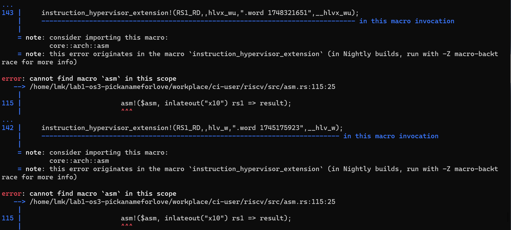

这个错误在第二章的时候出现过，将risc-v os的源从github改为gitee即可。

然后开始实现练习中的```sys_task_info```系统调用。此系统调用需要返回当前运行任务的状态，调用的系统调用的次数统计，和运行的时间。

通过观察代码，每个```task```有一个绑定的```TaskControlBlock```，包括```TaskStatus,TaskContext```，这两个属性都是和该```task```唯一绑定的，联想到，系统调用的两个信息，系统调用的次数和运行的时间也是和```Task```唯一绑定的。但是运行时间需要做一下处理，只需要在```TaskControlBlock```里面添加一个```task```开始运行的时间即可，调用该系统调用的时候，用当前时间减去```task```开始运行的时间就是该任务运行的时间。修改之后的```TaskControlBlock```如下：

```rust
// os/task/task.rs
pub struct TaskControlBlock {
    pub task_status: TaskStatus,
    pub task_cx: TaskContext,
    // LAB1: Add whatever you need about the Task.
    pub task_begin_time: usize,
    pub syscall_times: [u32; MAX_SYSCALL_NUM],
}

```

修改了结构体的属性，对应的需要修改```os/task/mod.rs```中的```lazy_static!```中相关的```TaskControlBlock```初始化代码。

然后需要思考的是新添加的两个属性什么时候更新。```task_begin_time```利用```timer.rs```中提供的```get_time()```进行初始化，初始化的时机就是该任务的状态由```UnInit```变为```Running```的时候，涉及任务状态改变的只有两个地方，```os/task/mod.rs```中```TaskManager```的两个方法，```run_first_task```和```run_next_task```。

```syscall_times```更新的时机，就是```task```调用系统调用的时候，也就是```os/syscall/mod.rs```里面的```syscall```函数。更新的时候有个难点，如何确定当前运行的是哪个任务。通过理解框架代码，发现有一个全局的静态对象```TASK_MANAGER```，保存着当前运行的是哪个任务，并且还有加载进来的所有任务的```TaskControlBlock```。直接按照框架的风格，为```TaskManager```实现一个私有方法，在外面提供一个公有函数接口。

```rust
// os/task/mod.rs
 fn update_syscall_times(&self, syscall_id: usize){
        let mut inner = self.inner.exclusive_access();
        let index = inner.current_task;
        inner.tasks[index].syscall_times[syscall_id] +=  1;
  }
pub fn update_syscall_times(syscall_id: usize){
    TASK_MANAGER.update_syscall_times(syscall_id);
}
```

最后就是系统调用的实现了，与上面的逻辑相似。

```rust
// os/task/mod.rs
fn set_task_info(&self, taskinfo: *mut TaskInfo){
        let inner = self.inner.exclusive_access();
        let t = (get_time() - inner.tasks[inner.current_task].task_begin_time)*1000/CLOCK_FREQ;
        // print!("{}",t);
        unsafe {
            *taskinfo = TaskInfo{
                // status: inner.tasks[inner.current_task].task_status,
                status: TaskStatus::Running,
                syscall_times: inner.tasks[inner.current_task].syscall_times,
                time: t,
            };
        }
       
    }
pub fn set_task_info(taskinfo: *mut TaskInfo){
    TASK_MANAGER.set_task_info(taskinfo);
}
// os/syscall/process.rs
pub fn sys_task_info(ti: *mut TaskInfo) -> isize {
    set_task_info(ti);
    0
}
```

### 7.8

今天继续阅读第四章的文档，也就是lab2的文档。相比于lab1的文档，这次阅读文档不太顺利，原因是我之前对于页表的理解有些问题。

我之前一直以为多级页表中每个节点的每一项都是分为两个部分，虚拟页号和物理帧号，但是这里有问题，页表项不需要留出空间给虚拟页号。因为处理的时候会将物理帧按照数组组织，下标即为虚拟页号。那么就不需要再页表项中预留空间存虚拟页号了。

然后读完了文档就开始写代码了，着手解决系统调用sys_get_time的系统调用。给出的提示是由于采用了虚拟内存，需要修改sys_get_time。那么需要修改的一项就是该系统调用传入的指针了，这个指针应该是虚拟地址，需要手动转化为物理地址。

刚开始觉得系统调用是在内核态下执行的，所以觉得该虚拟地址是内核空间的，所以用内核内存空间转化了一下。代码如下：

```rust
// os/syscall/process.rs
pub fn sys_get_time(_ts: *mut TimeVal, _tz: usize) -> isize {
    let _us = get_time_us();
    let vaddr = _ts as usize;
    let vaddr_obj = VirtAddr(vaddr);
    let page_off = vaddr_obj.page_offset();

    let vpn = vaddr_obj.floor();
    
    
    let ppn = KERNEL_SPACE.lock().translate(vpn).unwrap().ppn();

    let paddr : usize = ppn.0 << 10 | page_off;
    let ts  = paddr as *mut TimeVal;
    unsafe {
        *ts = TimeVal {
            sec: _us / 1_000_000,
            usec: _us % 1_000_000,
        };
    }
    0
}
```

然后转念一想，这个地址是在用户程序中传入的，应该是用户程序的内核空间中的地址。然后使用用户空间翻译了一下

```
// os/syscall/process.rs
pub fn sys_get_time(_ts: *mut TimeVal, _tz: usize) -> isize {
    let _us = get_time_us();
    let vaddr = _ts as usize;
    let vaddr_obj = VirtAddr(vaddr);
    let page_off = vaddr_obj.page_offset();

    let vpn = vaddr_obj.floor();
    
    let ppn = translate_vpn(vpn);

    let paddr : usize = ppn.0 << 10 | page_off;
    let ts  = paddr as *mut TimeVal;
    unsafe {
        *ts = TimeVal {
            sec: _us / 1_000_000,
            usec: _us % 1_000_000,
        };
    }
    0
}

// os/task/mod.rs
impl TaskManager {
fn translate_vpn(&self, vpn: VirtPageNum)-> PhysPageNum{
        let mut inner = self.inner.exclusive_access();
        let current = inner.current_task;
        let CurrentAppSpace = &inner.tasks[current].memory_set;
        let ppn = CurrentAppSpace.translate(vpn).unwrap().ppn();
        return ppn;
    }
}


pub fn translate_vpn(vpn: VirtPageNum)-> PhysPageNum{
    TASK_MANAGER.translate_vpn(vpn)
}
```

但测试了一下，还是不行，这就有点儿费解了。

7.9

今天继续debug，想一想为什么sys_get_time不行，答案找到了，找到了两个错误的地方，一是我将ppn左移10位了，这显然是不对的，page的大小为4k。需要左移12位。二是我之前觉得调用系统调用的时候CPU执行的任务发生了改变，因此构造了一个last_task的属性，但是经过思考之后发现，系统调用还是处于当前的任务之中，不过是将CPU的主导权放到了内核态中。

然后就继续修改sys_task_info这个系统调用。这个系统调用还是同样的思路，通过查页表找到对应的物理的地址，然后进行写入，这里直接把实验一的代码搬过来即可。

但是在实现的时候发现一个问题，本实验TaskStatus的定义和实验一不同，没有Uninit状态，因此我就不能用之前的方式来设置任务的启动时间了，仅仅是在TASK_MANAGER初始化的时候调用get_time()作为任务的启动时间。然后调用sys_task_info时候获得的时间get_time()减去这个时间即可得到任务的运行时间，但是我在测试的时候发现这个运行时间不太准，比较随机，有时候是480ms左右，有时候是490ms左右，有时候是502ms左右，但是只有在500ms左右的时候才能通过测试。这就不清楚为什么会出现这种情况了。（ps：这个似乎可以投机取巧一下，在返回的taskinfo中，将执行时间加个12ms就可以过了，不知道这种允许不允许:smile:

并且由于TaskStatus定义的不同，会造成一个奇怪的现象，TaskStatus::Running != TaskStatus::Running。需要在本实验TaskStatus的定义中加入Uninit状态，才可以通过这一项测试。

然后就是实现 sys_mmap了，这里一个坑点是文档中提示的“可能的错误”，被我理解成了以往的参与者会犯的错误，没想到是这个函数包含的错误的情况，也就是说碰到这些情况时，系统调用需要返回-1.

实现这个系统调用最伤脑筋的是判断一个虚拟页号是否已经有映射了，这里的函数调用比较复杂，

$sys\_mmap()\rightarrow contains\_key() \rightarrow  task\_manager.contains\_key()  \rightarrow memoryset.contains\_key() \rightarrow MapArea.contains\_key()$。

```rust
// os/src/task/mod.rs
pub fn contains_key(vpn: &VirtPageNum)-> bool{
    TASK_MANAGER.contains_key(vpn)
}
impl TaskManager{
    fn contains_key(&self, vpn: &VirtPageNum)-> bool{
        let mut inner = self.inner.exclusive_access();
        let current = inner.current_task;
        inner.tasks[current].memory_set.contains_key(vpn)
	}
}

// os/src/mm/memeory_set.rs
impl MemorySet{
    pub fn contains_key(&self, vpn: &VirtPageNum) -> bool{
        let mut result = false;
        let l = self.areas.len();
        for i in 0..l{
            let res = self.areas[i].contains_key(vpn);
            result = result | res;
        }
        return result;
    }
}
impl MapArea{
    pub fn contains_key(&self, vpn: &VirtPageNum)-> bool{
        self.data_frames.contains_key(vpn)
    }
}

```

在进行上面的判断之后，就可以执行添加操作了，这里直接利用框架代码，提供的memory_set.insert_framed_area()函数。

最后就是sys_munmap的实现了。还是先利用上面实现的功能判断给定的虚拟页空间，是否存在没有映射的页。如果存在，则直接返回-1. 反之，进行这块虚拟页空间的释放。这里涉及到两个结构的更新，一是Vec\<MapArea\>，二是PageTable的更新。这里利用pageTable提供的unmap函数即可。

按照上面所说的写完代码之后，本地测试出现了几个问题，一是test 4_01（这里用输出结果指代测例）始终过不了，并且没有assertion error。二是test 4_05测例过不去，有assertion error，说的是在21行，最后一个assert!语句处报错。

最后就是今天编程的一点儿体会，发现我的rust编程还是没有登堂入室，时常会犯一些错误，比如没有加mut，不知道vec.iter()会转移所有权等等，只能指望编译器给我指出这些错误。

### 7.10

今天就是继续debug，看看昨天的两个bug是为什么。

发现了第一个bug是由于我没有设置PTE::U位，导致了一个结果----可以正常申请内存，但是申请下来的内存无法访问。改了这个，test 4_01就可以正常通过了。

第二个bug主要是因为我在sys_mmap和sys_munmap这两个系统调用中确定的虚拟页号空间有问题。我之前一直以为MapArea里面的VPNRange是闭区间，所以我start和end两个vpn全用的是floor，结果检查了一下VPNRange的迭代器代码才知道这个区间是左闭右开区间，所有就很自然地把end换成了ceil方法。

在该代码的时候还遇到一件有趣的事情。我尝试将MapArea.contains_key()方法的实现用VPNRange来代替，结果一代替的话，出现了很多bug，这让我十分苦恼。

```rust
// os/src/mm/memeory_set.rs
pub fn contains_key(&self, vpn: &VirtPageNum)-> bool{
        self.vpn_range.get_end().0 >= vpn.0 && self.vpn_range.get_start().0 <= vpn.0
    }
```

想了一下这个区间是左闭右开区间，因此问题是多加了一个等号，应该是```self.vpn_range.get_end().0 > vpn.0 && self.vpn_range.get_start().0 <= vpn.0```，改完之后就正常了。

但是改完之后，test4_05本地测试还是过不去(sys_task_info的那个测例，我取了个巧，直接在返回值taskinfo的执行时间中加了个12ms).

但是奇怪的是，我把这一版上传到云端，云端居然测试通过了，这实在是很神奇。

### 7.11

今天主要是读第五章的文档。

### 7.12

今天开始尝试编写代码，尝试着把sys_get_time, sys_task_info, spawn这几个系统调用，spawn这个系统调用可以简单的看作fork和exec的结合。不过是不需要拷贝父进程的地址空间了，直接指定elf获得的地址空间。

sys_get_time和sys_task_info这两个系统调用需要修改，这个实验的结构又有了大变，没有了全局的TASK_MANAGER，因此这次需要在全局的PROCESSOR上进行操作。

稍微看了看sys_set_priority，仅仅实现这个系统调用就可以了吗？框架中实现了stride算法的后续步骤了吗，我们需要实现后续的代码吗？

在make test5的时候发现程序一直卡在chapter 5的一个测试set_priority，卡一段时间，然后测试就退出了，连我写好的系统调用也没有进行测试。

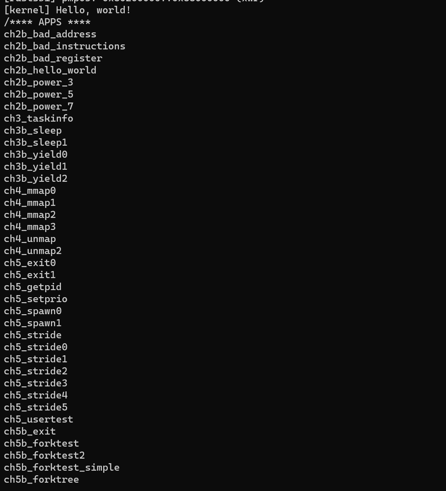

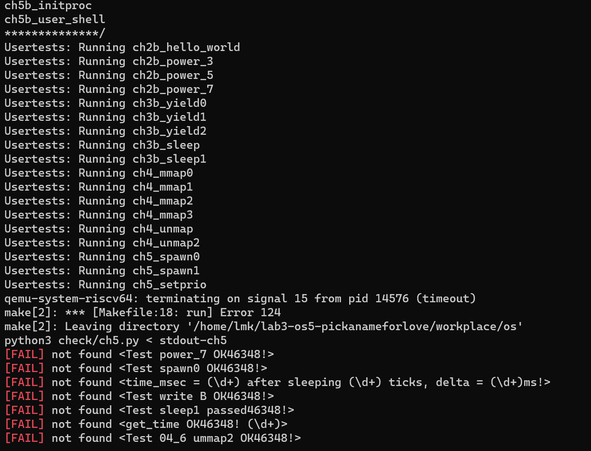

如图所示的情况，可以看到APPS还有很多，usertests没有完全加载完，qemu模拟器就退出了。

还有一个值得注意的地方，我在实现sys_task_info的时候，需要向TaskControlBlock中添加一个属性syscall_times，有两个地方可供选择，第一种方法最简单，直接作为TaskControlBlock的属性，二是作为TaskControlBlockInner的属性。前者似乎无法获取到可变引用。所以最终选择了后者。

### 7.13

今天将实验三剩下的几个系统调用写完了，但是测试没有通过。

关于昨天的问题----“仅仅实现sys_set_priority就可以了吗？框架中实现了stride算法的后续步骤了吗，我们需要实现后续的代码吗？”，答案是我们需要实现后续的步骤，也就是实现TaskManager的fetch方法。如下图

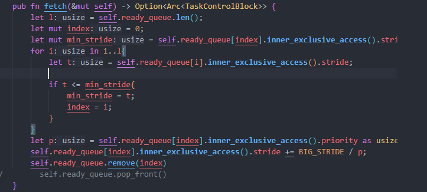

但是这样的stride算法，无法通过两个sleep测例。

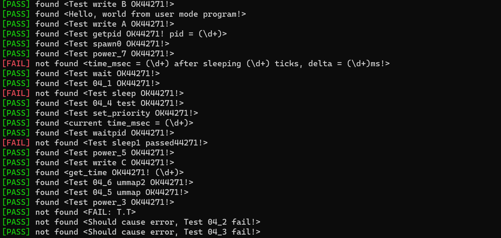

另外今天发现了之前的一个问题，之前疑惑为什么实验二在本地测试无法通过，在云端就可以通过测试，这是因为我没有执行make setupclassroom_test4！！！！

知道这个问题之后，又投入到了实验二的修改之中，直接修改ci-user下的测例，通过输出发现，sys_munmap实现的有问题，复查了一下发现，是一个等号的问题，因为这个等号，多删了一个pte，所以测例就无法通过了。如下图所示。

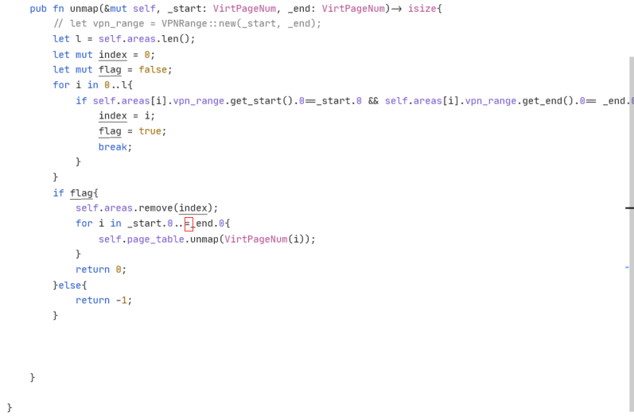


然后就开始研究实验五了，发现了昨天晚上为什么make test5过不去了，我spawn的实现错了，少加了TrapContext初始化的代码，加了之后就可以正常运行了。

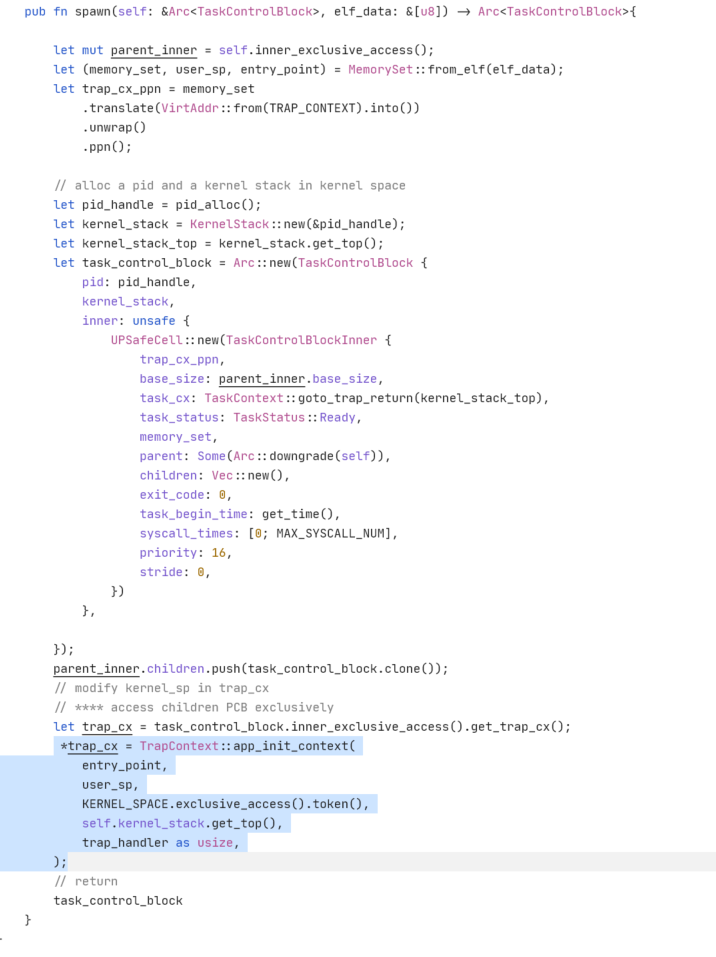

关于上面stride算法失效的问题。查阅了一下资料，上面是因为stride的溢出问题。解决方法如下图：

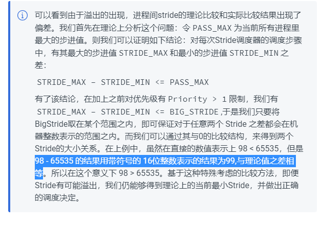

函数变成了如下所示：

```rust
    pub fn fetch(&mut self) -> Option<Arc<TaskControlBlock>> {
        let l = self.ready_queue.len();
        let mut index = 0;
        let mut min_stride = self.ready_queue[index].inner_exclusive_access().stride;
        for i in 1..l{
            let t = self.ready_queue[i].inner_exclusive_access().stride;
            let difference = (t - min_stride) as isize;
            if difference <= 0{
                min_stride = t;
                index = i;
            }
        }
        let p = self.ready_queue[index].inner_exclusive_access().priority as usize;
        self.ready_queue[index].inner_exclusive_access().stride += BIG_STRIDE / p;
        self.ready_queue.remove(index)
//        self.ready_queue.pop_front()
    }
```

解决了上面的问题之后，发现最后一个stride的测试无法通过。

此外，自己终于理解了processor中的那个idle_task_cx，这个idle理解起来是有问题的，可以理解为processor当前执行的任务空闲了，然后idle_task_cx就是这个空闲的任务的task_context，经过阅读代码之后发现这是不对的，这个idle_task_cx，应该指的是主进程，每次cpu切换到idle_task_cx就会执行，run_tasks()这个函数了，也就是寻找下一个可以运行的任务。

### 7.14

今天上午初步确定了最后一个测试无法通过的原因是stride的溢出问题。

并且得知我昨天的那种修改方式似乎是不对的，[关于rust数值溢出的博客](https://imzy.vip/posts/36864/)说在debug模式下，运行阶段检测到了可能出现溢出的减法，程序会直接panic。在release模式下，运行阶段检测到了可能出现溢出的减法，溢出会舍弃高位。

并且我没有修改可能造成溢出的update stride操作。

因此重新思考为什么换成了stride调度算法时候，两个sleep测例无法通过，原因可能是写的第一版无法调度到他们。

然后将可能造成溢出的加减法，替换成了wrapping_add/sub方法。

总结了一下处理stride的溢出的关键点在于将stride的差值控制在机器数可以表示的范围内。从写代码的角度来看，最关键的就是下面这行代码：

```rust
let difference = (t - min_stride) as isize;
```

上面的```t```和```min_stride```都是usize类型，文档中说。

> 在不考虑溢出的情况下** *, 在进程优先级全部 >= 2 的情况下，如果严格按照算法执行，那么 STRIDE_MAX – STRIDE_MIN <= BigStride / 2。

因此```t```和```min_stride```的差值位于[-BigStride/2,BigStride/2]之内，也就是isize的区间了。

但是替换成这样子之后还是无法通过！！！！！

通过查看其他同学的项目，核心逻辑都一样，只不过他所有和stride相关的变量用的是u8和i8，而我使用的是usize和isize，前者就可以通过测试，后者就无法通过测试。

后来又试了一下u16，u32，都不可以。搞不清楚是为什么。

### 7.15

今天看了第六章的文档。这个文档比较复杂。

有一些混淆的地方。

* 文件和目录，文档中将文件和目录写成了同一层次的东西。但通过看代码得知，获取文件内容的流程是，给定文件名，根据文件名去找DirEntry，根据DirEntry里面的inode_number解析出文件inode所在的blockid和offset.通过文件的inode获取文件的内容。因此逻辑结构上，目录是在文件之上的。
* DirEntry的inode_number和blockid混淆了。因为文档中指定一个物理block中存四个inode，因此上DirEntry给一个blockid是无法唯一指定inode的，并且结合代码得知inode_number是由blockid和offset构成的。
* Super Block与ROOT_INODE混淆了，Super Block是磁盘的第一个块，记录了磁盘的相关划分信息。而ROOT_INODE是根目录的Inode，包含了根目录包含的DirEntry所在的物理块的blockid。我们在实现系统调用的时候，所有的操作都要基于ROOT_INODE来进行操作，从他这里获取到文件的inode，进而获取文件的内容。
* DiskInode，Inode和OSInode混淆了，这三个是逐步升级的封装。DiskInode就是最基本的文件inode，包含了文件内容所在的数据块的索引。至于其他两个的作用，目前还不清楚。
* DiskInode和block混淆了，据文档所说，一个物理block（512B)上面有4个DiskInode(128B)。
* 和DiskInode相关的两个offset混淆，一个offset是用于指明当前DiskInode所在的block的位置的，毕竟一个block可以容纳4个DiskInode。另一个和diskInode相关的offset则是读取DiskInode关联的数据块中的数据时的offset，文件系统实现的时候将inode和数据节点的区别隐藏了，在inode节点上调用的read方法返回的就是该inode节点关联的数据节点上的数据。处理的时候将这些数据视为一个数组，即读取的时候需要不断地指定offset，直到读取完数据。
* 将逻辑上文件与目录的依赖关系和具体实践上文件和目录的独立混淆了。逻辑上的话，文件系统就是一棵树，树的叶子节点就是文件。非叶节点就是目录。因此从逻辑上来讲目录是依赖于文件而存在的，文件依赖着目录的索引功能。但是在实践上，这两种结构就是完全独立的，一个文件，具体实现起来的话，是inode+数据节点的结构。而一个目录，实现起来的话，也是inode+数据节点的结构。不同的是文件的数据节点中的数据是没有特定结构的二进制数据，而目录的数据节点中存储的是目录项，由名称和inode_number组成。那么这就有问题了，在目录与文件独立的实现结构下，如何实现文件的索引呢？答案就是目录项的inode_number，他是目录项名字对应的inode，无论是文件也好，还是下一级目录也好，获得这个inode_number就可以进行迭代的索引了，直到索引到想要的文件为止。


### 7.16

今天主要是写代码了，昨天写完了以往实验中的系统调用，今天主要是着重在与文件系统相关的三个系统调用。sys_linkat，sys_unlinkat，sys_fstat。

刚开始的时候完全是懵的，sys_linkat完全不知道怎么实现，主要是我没有对文档理解透彻。比如把逻辑上文件系统的结构带进去了，因为逻辑上，文件系统是一个树的形式，树的每一个节点就是一个inode，那么sys_linkat的实现，岂不是要在ROOT_INODE上面加一个inode。可是问题又来了，这个硬链接是一个inode嘛？inode对应的数据节点里面存什么东西呢？

上面纯粹就是理解混了。ROOT_INODE是一个目录，他有配套的inode+数据节点。inode用于索引数据节点，而数据节点中存的是一个个的目录项。这些目录项由名字和inode_number组成，inode_number用于索引inode。如此便可以不断索引下去，直到遇到文件的inode，读取文件内容即可。

想明白这个，sys_linkat的思路也就出来了，就是在ROOT_INODE下面新建一个目录项，目录项的名字是给定的_new_name，目录项的inode\_number和\_old\_name对应的目录项一样的。

```rust
pub fn create_hard_link(&self, o_name: &str, n_name: &str) -> isize {  
        if o_name == n_name {
            return -1;
        }
        if let Some(inode_number) =
            self.read_disk_inode(|disk_inode| self.find_inode_id(o_name, disk_inode))
        {
            let mut fs = self.fs.lock();
            self.modify_disk_inode(|root_inode| {
                // append file in the dirent
                let file_count = (root_inode.size as usize) / DIRENT_SZ;
                let new_size = (file_count + 1) * DIRENT_SZ;
                // increase size
                self.increase_size(new_size as u32, root_inode, &mut fs);
                // write dirent
                let dirent = DirEntry::new(n_name, inode_number);
                root_inode.write_at(
                    file_count * DIRENT_SZ,
                    dirent.as_bytes(),
                    &self.block_device,
                );
            });
            return 0;
        } else {
            return -1;
        }
        
    }
```

实现了这个之后，遇到一个意想不到的问题。怎么把系统调用的参数* const u8转换为&str呢？

通过查阅资料，得知了* const u8这种类型称为ptr，并且这种类型无法通过index索引。将其转化为&str的方法如下:

```rust
     unsafe {
             let mut _end = _name;
             while _end.read_volatile() != 0u8 {
                 _end = _end.add(1);
             }
             let _slice = core::slice::from_raw_parts(_name, _end as usize - _name as usize);
             let name = core::str::from_utf8(_slice).unwrap();
         }
```

先将其转为slice，而后转为&str。

但是通过阅读框架代码，发现框架提供了一种翻译的方法:smile:

然后就是sys_unlinkat，解除硬链接方法。也就是将目录项删除即可，但是还需要注意一种特殊情况。提供的名字是文件inode的唯一索引，这时候就需要将文件删除。

这里需要实现一个根据inode_number获取索引次数的方法，大概的思路就是对root_inode下面的目录项一个个读取，如果inode_number与给定的吻合，累计次数加一即可。

```rust
pub fn get_inode_number_times(&self, inode_number: u32) -> usize{
        let _fs = self.fs.lock();
        self.read_disk_inode(|disk_inode| {
            let file_count = (disk_inode.size as usize) / DIRENT_SZ;
            let mut res = 0;
            for i in 0..file_count {
                let mut dirent = DirEntry::empty();
                assert_eq!(
                    disk_inode.read_at(i * DIRENT_SZ, dirent.as_bytes_mut(), &self.block_device,),
                    DIRENT_SZ,
                );
                if dirent.inode_number() == inode_number{
                    res += 1;
                }
            }
            res
        })
    }
```

实现了这个之后，接下来就是删除目录项的功能了，我这里实现的时候就按最简单的实现了。直接将该目录项所在的位置重写成一个空的目录项。当然也可以更复杂一点儿的，该目录项后面的元素直接向前覆盖一个单位就行。

```rust
self.modify_disk_inode(|disk_inode| {
                    // append file in the dirent
                    let file_count = (disk_inode.size as usize) / DIRENT_SZ;
                    let mut dirent = DirEntry::empty();
                    for i in 0..file_count {
                        assert_eq!(
                            disk_inode.read_at(DIRENT_SZ * i, dirent.as_bytes_mut(),&self.block_device,),
                            DIRENT_SZ,
                        );
                        if dirent.name() == name {
                            let dirent = DirEntry::empty();
                            disk_inode.write_at(
                                DIRENT_SZ * i,
                                dirent.as_bytes(),
                                &self.block_device,
                            );
                        }
                    }
                    
                });
```

最后就是文件状态的系统调用了，这个最麻烦，主要是我刚开始不知道通过_fd获得的文件描述符怎么处理。折腾了好久，终于发现了打开文件之后，向文件描述符表中，存的是OSInode类型的数据，那么向File trait添加get_inode_number，get_type方法即可。让OSInode实现就行。

```rust
fn get_inode_number(&self) -> usize {
        let mut inner = self.inner.exclusive_access();
        return inner.inode.get_inode_number();

    }
    fn get_type(&self) -> usize {
        let inner = self.inner.exclusive_access();
        return inner.inode.get_inode_type()
    }
```

这里获取inode_number需要从blockid和blockoffset还原出来inode_number。

```rust
pub fn get_inode_number(&self) -> usize{
        let inode_size = core::mem::size_of::<DiskInode>();
        let inodes_per_block = (BLOCK_SZ / inode_size) as u32;
        let tem1 = self.block_id - self.fs.lock().inode_area_start_block as usize;
        
        return tem1 * (inodes_per_block as usize) + self.block_offset/inode_size
    }
```

这个代码是从easyFileSystem的一个方法中，逆写出来的。

实现中一些值得注意的问题。

* os6/src/syscall/process.rs中第三行use core::slice::SlicePattern，这一行会报错，需要注释掉才可以正常运行。
* 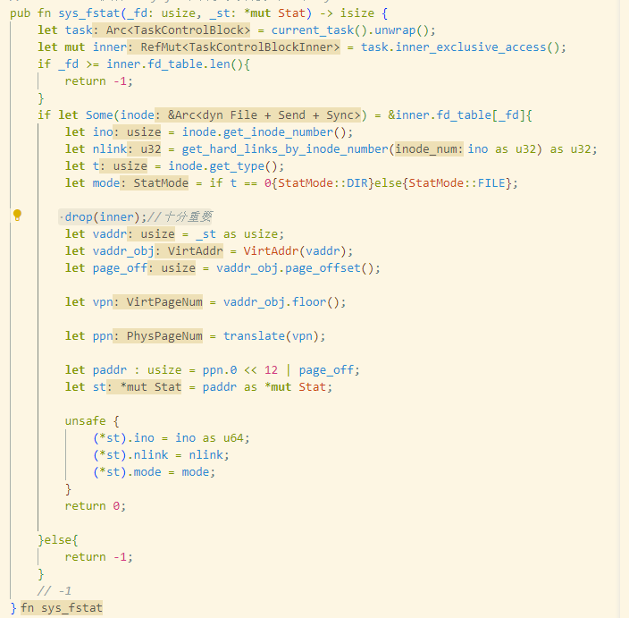
* 图中的drop(inner)十分重要，需要手动释放掉资源。后面的translate方法也需要inner这个资源。

### 7.17-7.18

这两天有事情，耽搁了一下。

不过昨天群里讨论了一下lab3-os5的最后一个测例的问题，得出来的结论是计时器不准，如果计时器不准的话，那么实现的stride算法和测试代码就对不上了，因为我们以为过了一个时间片，对该程序加了一个pass，但实际占用的cpu时间不够一个时间片，那么这个pass就加多了，对之后的调度不利。并且这个计时器不准不是偶尔出现的，根据观察到的现象来看，出现的频率还是蛮多的。测试代码是对spin_delay函数在4000ms时间内调用的次数，六个程序都运行一样的代码就是优先级不一样。

重新看了一下测试代码，是六个程序总共运行的时间是4000ms，不是每个程序都运行4000ms的时间，因此理想状况是优先级高的程序占的4000ms的比例多，运行的spin_delay函数次数多，而优先级低的程序占的比例少，运行的spin_delay次数少。

~~因此可能的逻辑关系是，高的优先级的进程碰到了计时器不准的情况，没有运行多少的spin_delay，却加了一个单位的pass，因此4000ms内完成的spin_delay函数的次数反而很小，因此不满足公平性要求。~~

在运行测试的时候，经常看到一种情况，五个进程差不多同时结束，进行了最终的输出，输出了count, prio, count/prio。但总有一个进程还要等相当的时间才可以结束，进行输出。

因此可能的逻辑关系是，这个程序碰到了计时器不准的情况，运行的spin_delay函数次数较少。因此在4000ms的时候，其他程序count%400==0，可以退出了，他还差一些，因此最后那段时间就是在运行spin_delay，使得count%400==0。

我在看到这个问题之后，连忙试了一下make test5，结果发现过不去了。。。。。这个代码之前可是可以很顺利的通过的。。然后18号晚上又试了一下，又可以通过了。。。应该就是计时器不准的问题。

### 7.19

今天读了一下lab5-os8的文档。文档引入了线程的概念，执行的单位成了线程，进程是分配资源的基本单位，进程中保留有所属于它的线程的列表。进程中还保留有互斥资源的列表。

然后开始写代码，代码是实现一个死锁检测算法。enable_deadlock_detect从名字来看，这个系统调用仅仅是设置一个标志位，允许死锁检测。如果允许的话，我们需要在分配资源之前进行一下死锁检测。

现在卡在如何获取allocate vectors和needed vectors这两个信息。想的是在semphore up和down的时间进行更新有关的数据结构。但是semphore的up和down方法，仅仅可以获取到当前线程的tid，但是无法获取到semphore是哪个互斥资源，换句话说，在进程的互斥资源列表中，当前的semphore的下标是什么？

并且还不清楚allocate vectors和needed vectors这两个信息保存在哪里？是保存在线程中呢？还是保存在semphore中呢？

尝试了一下将allocate vectors和needed vectors这两个信息保存在线程控制块中，用的是hashmap存储的，结果我忘了我现在是在一个裸操作系统上编码，没有std的支持，然后就放弃了。并且这种hashmap存储也比较麻烦，键是arc\<Semaphore/Mutex\>，那么处理的时候就比较麻烦，还需要将键转为process的互斥资源的下标。很麻烦，所以就放弃了。

### 7.20

今天继续写代码，刚开始还是为allocate vectors和needed vectors这两个信息保存在哪里而迷茫，直到看到了sys_thread_create这个系统调用，明白了process中的线程列表是按照tid来组织的，中间可以有None的位置，而不是那种随便组织的，新建一个线程，直接把线程控制块push到线程列表中的形式。

这样的话，将allocate vectors和needed vectors这两个信息保存在semphore/Mutex中的话，就很方便处理了。这个是从mutex/semaphore的等待队列获取的灵感，等待队列完全可以等价于need信息，那么仅仅需要保存一个已经分配的信号量的线程列表即可。

semphore/mutex中的等待队列可以作为needed vectors，至于allocate vectors和work vectors就需要额外实现方法了，work vectors就是当前semphore/mutex返回可用的互斥资源数目。实现一个get_count方法即可，在mutex中，该方法仅仅能返回0或1. allocate vectors在semphore中需要额外新建一个属性，allocate_queue，用于记录该互斥资源的分配情况。

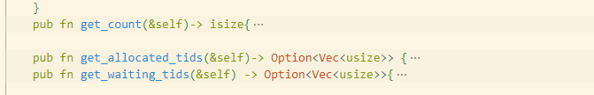

上面图片中的三个方法，mutex和semaphore都会实现，分别是获取该信号量/互斥锁的可用资源，分配给各个线程的情况，各个线程的等待情况。也就是work, allocate, need三个信息。

这一部分写完之后，开始进行死锁检测算法的实现。此处实现的时候发现了一个点，当调用死锁检测算法的时候，意味着有线程调用sem_down/lock方法，但是此时该线程还没有添加到sem/mutex的等待队列中，也就是如果仅仅是get_waiting_tids的话，就会缺少此次调用线程的需求信息。因此需要特别设置一下：

```rust
let c_task = current_task().unwrap();
let current_task_inner = c_task.inner_exclusive_access();
let current_task_res = current_task_inner.res.as_ref().unwrap();
let c_tid = current_task_res.tid;
Need[id][c_tid] += 1;
```

除此之外，还有一件很有意思的事情，文档中说，如果死锁检测算法没有通过，就要返回-0xDEAD值。我一开始误以为是在semaphore/mutex的down/lock方法中修改，直接把方法的签名给改了，原来没有返回值，改成了isize的返回值。后来才发现，需要在syscall里面有关的sem_down系统调用中修改。

经过一天的努力，29个测例通过了28个。

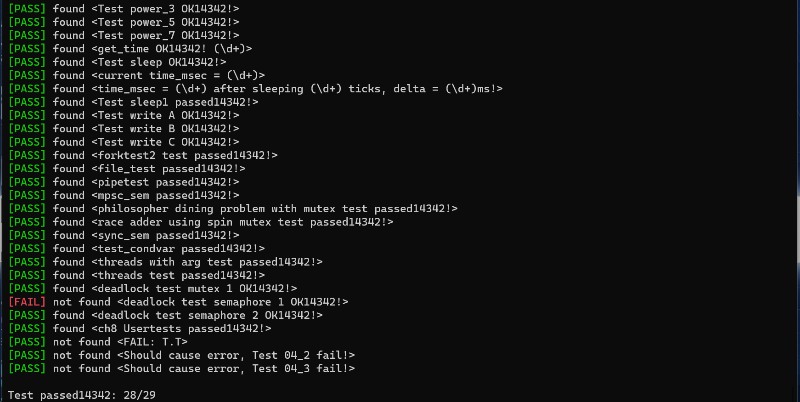

### 7.21

今天继续debug，为什么测例ch8_deadlock_sem1.rs无法通过。通过阅读代码发现了ch8_deadlock_sem1.rs的逻辑是：新建三个线程，分别申请三个初值为1,2,1的互斥资源，线程一申请了0,1,0，线程二申请了1,1,0,线程三申请了0,0,1。这个申请资源同时完成之后，后面他们再申请资源的时候就会检测到死锁。但是如果考虑到线程调度的话，比如：线程一先执行，线程一执行完了，线程二执行，而后线程三执行。这样的话，就不会出现死锁。每次申请资源都可以成功。

并且发现在每个线程执行的函数deadlock_test中添加一个sleep函数，测例就可以顺利通过。

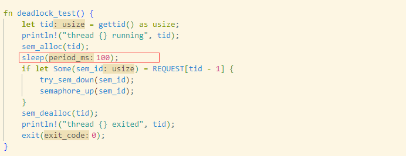

如上图所示，在线程一二三的第一次申请资源和第二次申请资源之间执行sleep(100)操作。让出CPU，这样的话测例就可顺利通过。

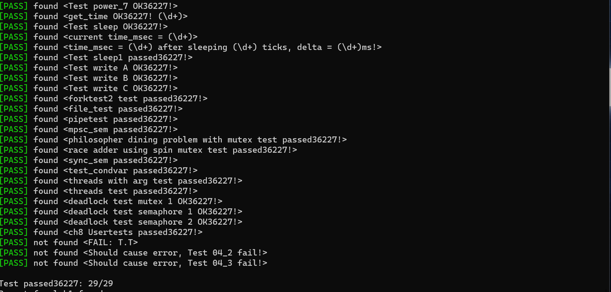

所以我在调试的过程中突然出现了一次29/29的情况，但是再运行的话，还是28/29的情况。然后就提了一个issue。

除此之外，还发现了一些其他的小问题。

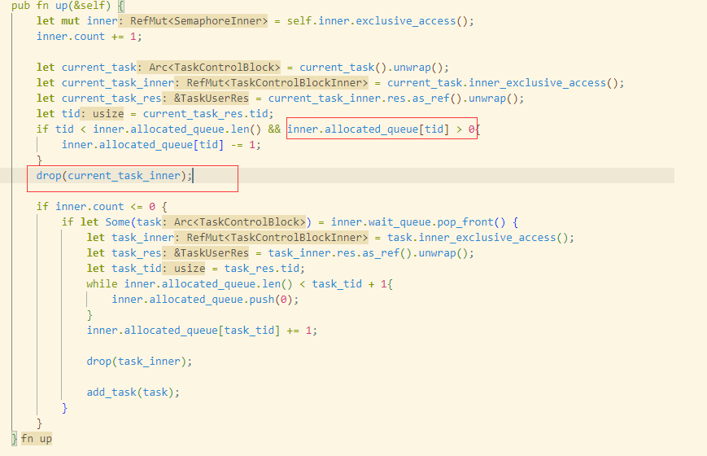

上图是semaphore的up函数，红框圈出来的地方，就是一些小bug。第一个小bug是由于semaphore的灵活性，up函数可能有两个语义，一是归还资源，二是仅仅是增加一个资源，之前没有占有资源。所以进行第一个红框的判断是必要的，判断它之前是否占有了资源。进而推断出此次up函数的意图。

第二个bug是由于current_task_inner这个互斥资源，下面可能会再次调用，所以需要手动释放。

然后还意识到一个问题，当线程不正常退出之后，他的互斥资源的回收也是需要考虑的。不过实验八的测例貌似没有检测这方面的问题。

然后总觉得改测例总是不太好，然后就继续研究哪里出现了问题。

然后看了看别人实现的代码，发现其他人实现的和我思路一样，但是work，allocated，need这几个信息存储的地方和我的不一样。他们是在process进程中存储的，存储了几个vec，而我是分散存的，每个semaphore存了与这个信号量相关的allocated和waiting信息。

并且发现别人实现的版本，不给测例加sleep也可以正常的通过。

然后仔细观察了这两个版本的输出。

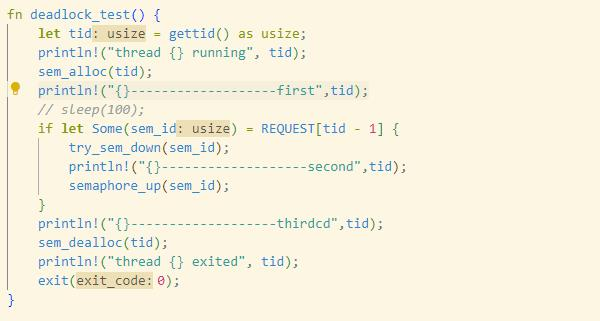

上图是测例中每个线程运行的函数，给其加了一些断点。

然后别人实现的版本如下：

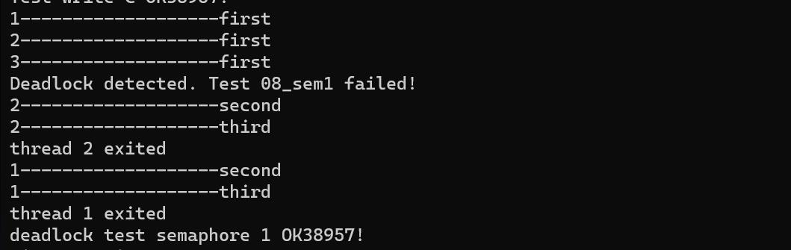

自己的版本如下：

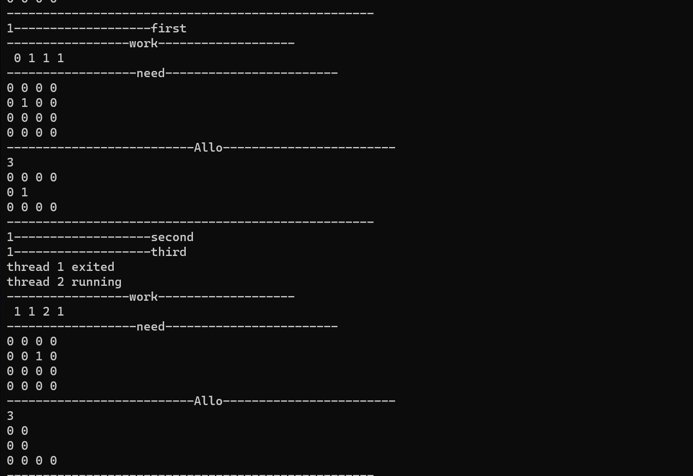

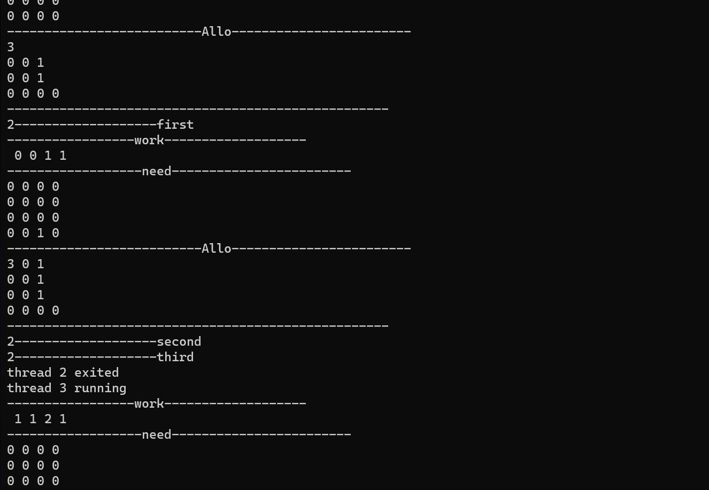

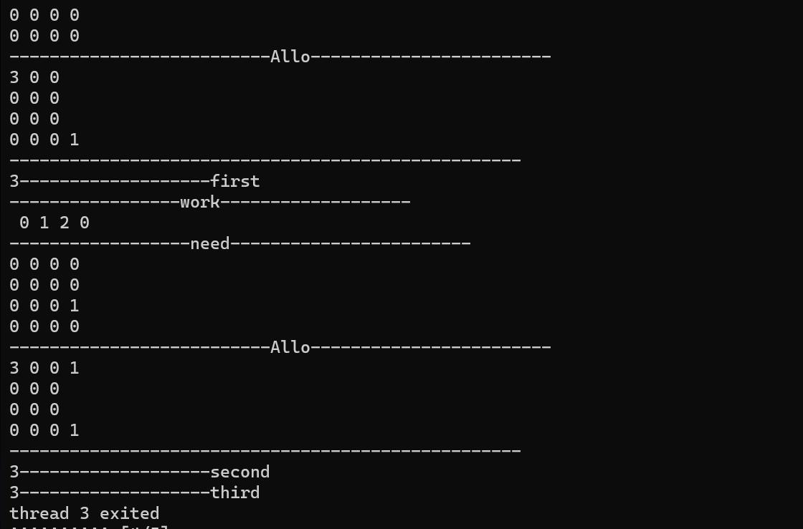

可以看到我的版本三个线程运行是线性的，而别人的版本三个线程先并行的实现第一阶段的资源分配，而后进行第二阶段的资源分配。

然后比较到此为止，找不到bug，就计划按照他那种写法重新写一下。

结果在写代码的过程中发现了自己代码的几个问题，修改了之后就成功运行了！！！！

几个bug如下：

第一个bug是获取当前信号量剩余的互斥资源的个数。

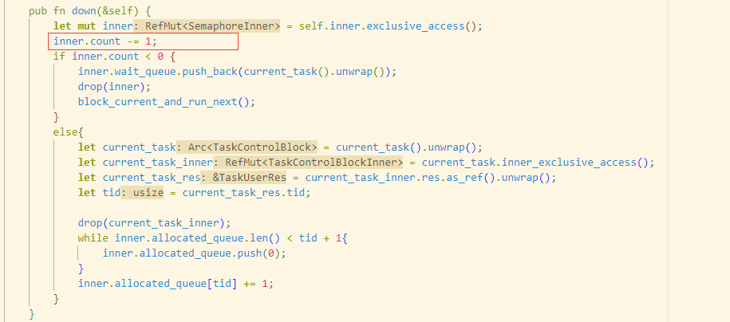

由于semaphore down函数实现的特殊性，无论合法不合法，inner.count都会先减一，那么count显然不能代表互斥资源的个数了。因此需要做一些变化。

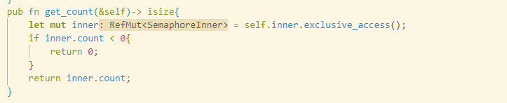

当inner.count小于0的时候，返回0.

第二个bug是在process的deadlock_detection函数中，由于这个函数有两个分支，因此第二个分支的semaphore检测就是copy的上一个mutex分支的代码，因此就是这个copy出现了一些问题，将l_mutex_len 复制过来了，没有变。

第三个bug还是在process中的deadlock_detection中，仅仅是把while写成了if。

全部修改就可以全部通过测例了。

### 7.22

今天尝试写了一下lab1的报告。

### 7.23-7.24

今天有事，耽搁了一下。

### 7.25

今天写了写剩下的实验的报告。

### 8.6

今天正式开始进行第二阶段的工作，今天下午进行了一个分组会议，陈老师对我这个模块化的rcore进行了一定的讲解，大致思路是我们需要重新实现操作系统，并且在实现的过程中需要注意能否将之前各个实验中重复的部分封装成一个crate。

并且今天稍微看了一下忒修斯OS，其中cell的对应关系分为，写代码时，编译时，运行时。其中后两个和我们这个项目没啥关系，需要重点关注第一个对应关系，也就是cell与crate的对应关系。

因此大致思路是重新实现操作系统，实现的过程中，可以参考忒修斯OS Kernel的相关crate。

除此之外还有个问题，我对OS内核如何进入qemu中执行一窍不通。这里需要研究一下。

解决了大概的思路问题，但是如果让我实现一个chapter2的操作系统，我还是一筹莫展，不过想到一个好的思路，首先是仔细研究杨德睿工程师的那个仓库中的chapter1.其次通过对比他的chapter1与rcore原本的实现，思考模块化与非模块化的区别。

### 8.7

今天对比了杨德睿工程师实现的那个模块化的chapter1和原版的chapter1.下面就是不同之处

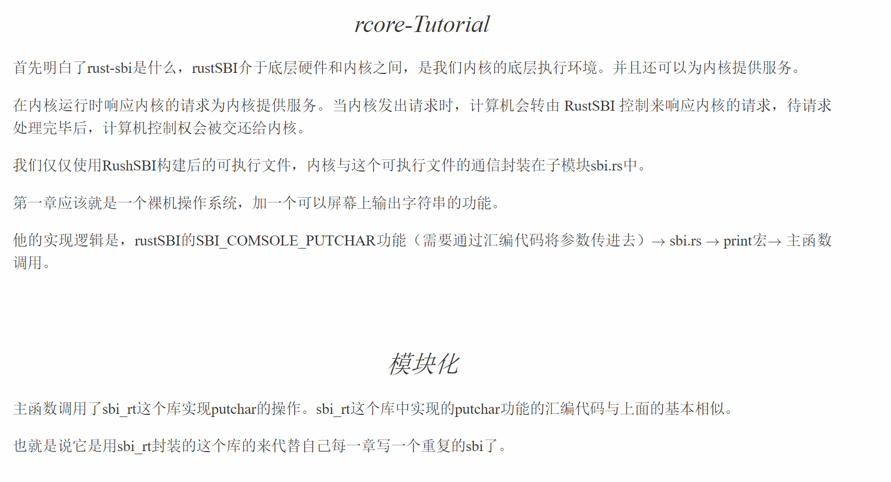

然后最终打算，还是按照rcore-tutorial里面的类，一个类一个类封装成一个个crate吧，先这样试试。

### 8.8

今天本来打算写代码的，结果由于如下的一个困境，导致我耽搁了下来。

“陈瑜老师fork了一下杨德睿的仓库，做成了一个github classroom的模板，然后我用这个模板生成了本地的仓库，然后发现杨德睿的原仓库更新了，那么如何把这个仓库的更新加上去呢？”

通过搜资料发现，可以利用git remote add命令和git fetch，fetch之后建一个本地分支与之对应，然后这个分支与本地的main分支merge就行。

但是在merge的时候出现了一些冲突。

然后就是搜如何在vscode上面可视化的解决这些冲突，结果发现插件GitLens需要在vscode设置git路径，但是这就引出一个问题来了，vscode是windows上面的软件，想要解决冲突的是linux上面的文件，linux上有对应的git路径，我总不能把Windows上的git路径设置到vscode里面，这就很别扭。

所以wsl还是有点儿畸形的。由于我把code添加到了PATH里面，wsl共享这个环境变量，我也不能再wsl里面重新下载一个code，这就很麻烦，最后还是手动把所有的冲突都给解决了。

### 8.9

今天耽搁了一天的时间，晚上开始进行这个项目，发现自己还是没有一个具体的思路。

原因可能是，这个实验要求我们模块化一个操作系统，这肯定的前提是自己实现了一个操作系统，但是自己前期的工作就是在别人搭好的os上疯狂的写syscall，也不清楚os底层的东西，所以现在就难以入手。

不管怎么样吧，既然选择了，就得做下去，不懂的学就行了。

碰巧杨德睿工程师的第二章也完成了，看一看他是怎么实现的，针对于自己的缺点，对操作系统如何执行这一部分仔细研究。

今天暂时先看了他的实现中，用户程序加载这一块。我之前不知道把用户程序加载放到什么地方，杨德睿工程师放到了程序build的这个地方，在build的时候，编译生成用户程序文件。具体的细节明天再看吧。

### 8.10

今天研究了一下应用程序加载的问题和时间中断相关的问题。

关于应用程序的加载问题，应用程序的加载分为三个阶段，编译成二进制文件；利用链接脚本将二进制文件链接到内核中；将应用二进制镜像加载到正确的地址执行（其实就是将二进制镜像从一块内存加载到另一块内存。）

#### 编译

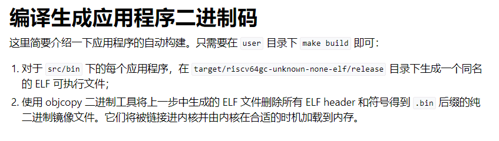

#### 链接

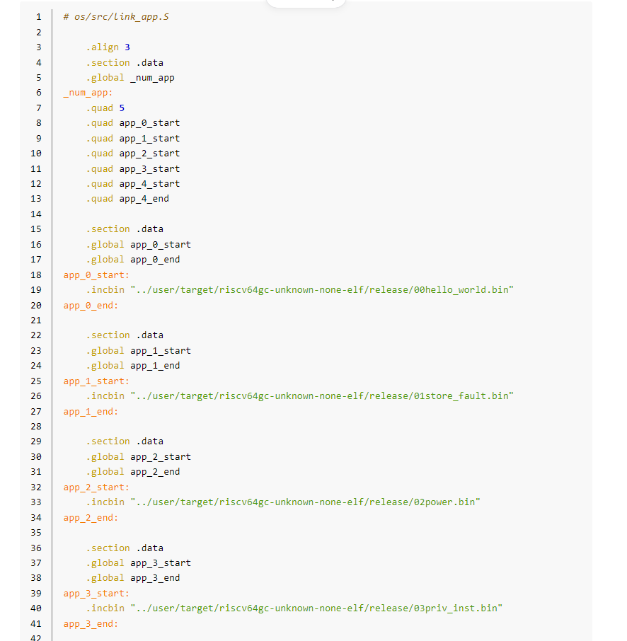

#### 加载

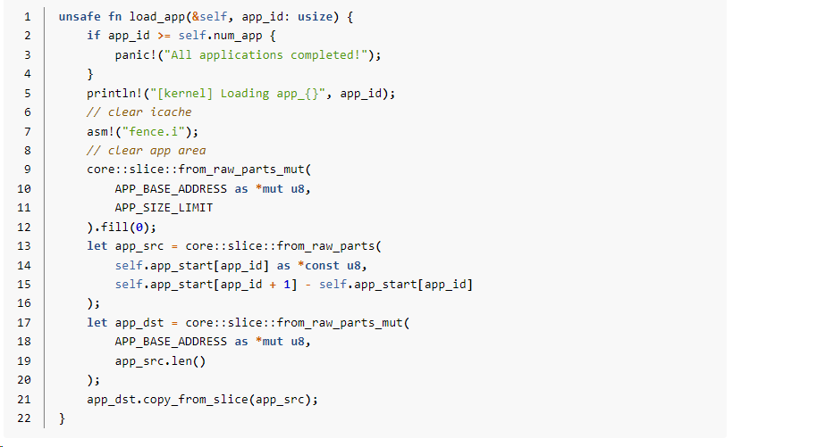


关于时间中断的问题给明确成了四个问题。

* 如何打开时间中断

  sstatus中的sie为S特权级的中断使能，如果为0，则会将三个中断都屏蔽，即使 `sstatus.sie` 置 1 ，还要看 `sie` 这个 CSR，它的三个字段 `ssie/stie/seie` 分别控制 S 特权级的软件中断、时钟中断和外部中断的中断使能。

* 如何处理时间中断

  看代码中是在trap_handler里面处理的。

  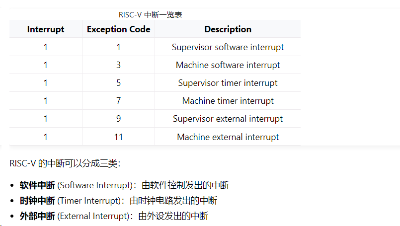

* 如何设置时间中断，通过设置CSR mtimecmp寄存器，一旦计数器 `mtime` 的值超过了 `mtimecmp`，就会触发一次时钟中断。这使得我们可以方便的通过设置 `mtimecmp` 的值来决定下一次时钟中断何时触发。可以使用rustSBI封装好的接口。

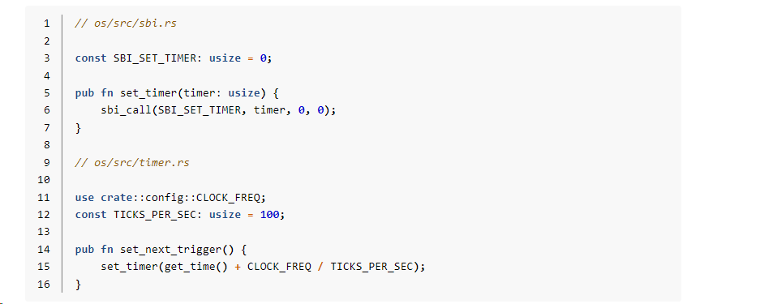

* 处理中断和syscall有什么联系。

  这里看最初的rcore代码，时钟中断会进入trap_handler这个函数，使用match语句分发trap或者中断，对他们进行处理。好像中断的处理和syscall没有关系。

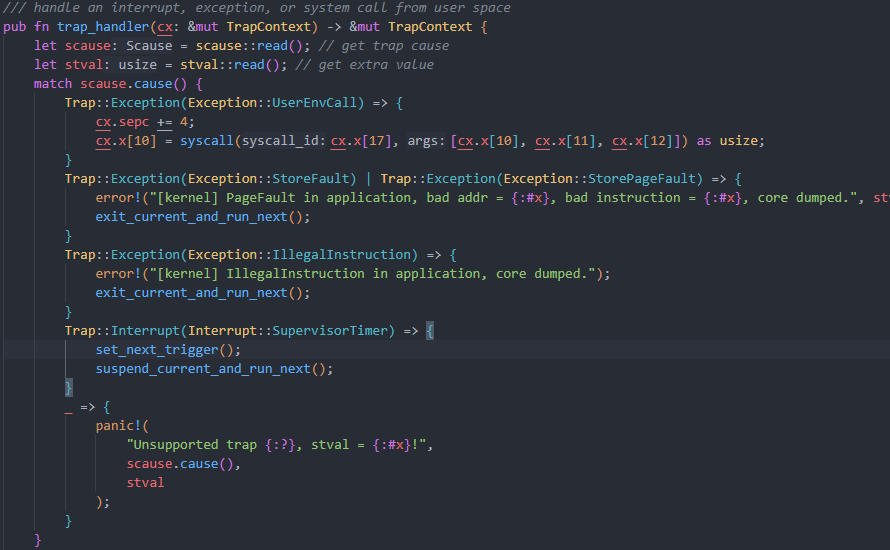

### 8.11

今天有事儿，耽搁了一天。

### 8.12

今天有事儿，耽搁一天。

### 8.13

今天刚开始看了看自己在杨德睿工程师实现基础上续写的os3为什么不能跑起来。

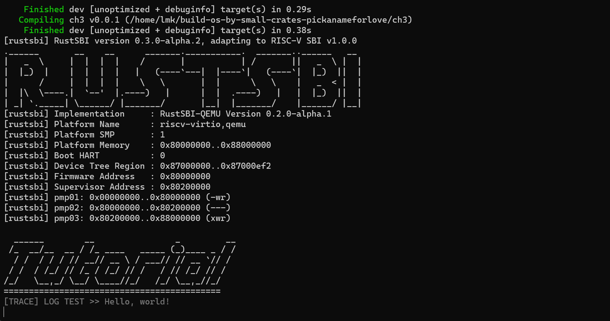

只能输出一个log。结果发现原因是操作系统最开始设置的栈太小了，只有4KB。搞成8KB就可以输出全部的log了。

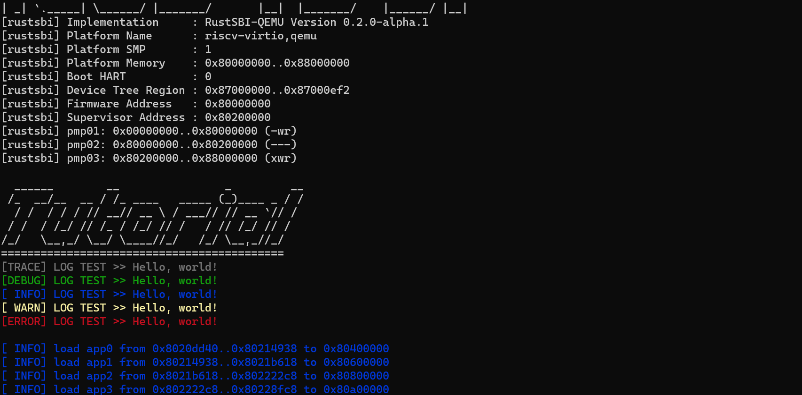

解决了这个问题之后，分时系统还实现的很有问题。但是找不到问题出在哪里。

只能换个法子了，从头看文档吧，采用王福音的路子，先不搞模块化了，先自己跟着教程走一遍，自己尝试实现，或者是说理解操作系统的运行流程，代码。

今天把第一章，三叶虫那一章给走完了。学到了很多第一阶段忽略的知识点。

### 8.16

今天开始实践第二章，批处理系统。

忙了很长一段时间的用户程序实现。

首先是user目录应该也是一个cargo项目，和内核os目录应该怎么组织呢？这是第一个问题。我直接采用了与os目录平行的目录下新建一个user项目。

第二个问题是如何理解user项目下的几个文件。

```src/console.rs```文件实现了输出函数，基于```src/syscall.rs```实现的。将与输出相关的函数都归到了这个文件中。

```src/syscall.rs``` 文件中声明了许多系统调用。

```src/lib.rs```文件中将syscall中的系统调用封装成了函数；实现了一些syscall文件中用到的结构体；还实现了user项目的入口函数。user项目先进入lib.rs的入口函数，经过处理之后，进入每个用户函数的main函数进行执行。

```src/lang_items.rs``` 文件提供了panic_handler功能。

第三个问题是如何编译出用户程序。通过查看原项目的makefile文件。

```
cargo rustc --bin ch2b_power_3 --release -- -Clink-args=-Ttext=0x80400000
```


在实现用户程序的时候，有下面一个问题

* 用户程序user里面也有系统调用的实现，这个和内核中系统调用的实现有何区别？

答案是，用户程序中的系统调用仅仅是向寄存器中传了个参数。并没有实际的处理。而内核中的syscall模块，没有传参部分，syscall的分发函数syscall的函数签名直接就是有参数的。直接进行处理，依靠着内核中实现的结构体的功能来实现具体的逻辑。因此syscall可以分为两部分，第一部分传参到寄存器，第二部分，拿到参数进行处理。

接着就是实现内核。

实现内核时候，对于如何链接应用程序到内核，还花了很长时间来研究。

关键是os根目录下的build.rs，这个build.rs动态生成link_app.S文件，需要注意的是这个文件的运行时机，是在cargo build的时候运行的。

在实现的过程中，突然有一种想要总结一下内核中的结构体，全局变量，常量，函数各自的“边界”。

#### 结构体

* UPSafeCell，特殊用途，用于包裹一个互斥资源。与内核的逻辑没有关系。
* TrapContex，抽象出用户上下文，用于Trap处理。其中还解决了我的一个疑惑，一个变量怎么能绑定到一个寄存器呢？对此暂时的答案是利用了riscv这个库实现的。
* AppManager，应用程序管理器。保存应用程序的信息，加载应用程序。
* KernelStack
* UserStack，其实应该一个应用程序一个UserStack，一个KernelStack的，但是批处理系统不会同时运行多个程序，是一个一个运行的，所以仅仅需要一个用户栈，一个内核栈。

#### 函数

* syscall模块中的函数，分为两类，syscall函数用于分发syscall，另一部分是具体的处理函数。为了实现具体的功能，需要依赖于结构体及其方法。
* trap/init函数，实现了trap处理的初始化，将trap处理的地址赋到具体的寄存器上面。
* trap/trap_handler函数，实现了trap处理的分发。这里的有一个分支是关于syscall的，实现的功能是从寄存器中获取参数，然后进行处理。
* batch/init，batch/print_app_info函数，依赖于APP_MANAGER这个全局变量。
* batch/run_next_app，依赖于APP_MANAGER这个全局变量和AppManager这个结构体。
* main/clear_bss。

#### 全局变量

* APP_MANAGER，应用管理器。
* SYSCALL_*，系统调用的序号
* USER_STACK_SIZE，KERNEL_STACK_SIZE，内核的配置变量。
* MAX_APP_NUM，APP_BASE_ADDRESS，APP_SIZE_LIMIT，内核的配置变量。

### 8.17

今天重点理解了一下之前不懂的地方。

* 批处理系统与分时多任务系统的不同主要是，批处理系统是运行完一个再load一个，而分时多任务系统是一次load多个。load的话，就是从data数据段copy到执行的地址。
* 操作系统初始化后如何运行第一个应用程序，采用了trap处理的后半段代码，__restore函数，所以需要在内核栈上需要压入一个Trap上下文
* 操作系统trap处理与switch处理的区别，trap是从U态切换到S态，又从S态切换到U态。而switch是内核态的两个任务上下文的互换。
* 分时多任务系统，也就是第三章的操作系统，在运行第一个程序的时候，需要显式的设置ra为$\_\_restore$函数的地址，但是在之后切换的时候没有显式的设置$\_\_restore$函数的值，这里的原因是在运行中的时候这里的switch处理是被包裹在Trap处理之中的，因此不需要显式设置。

### 8.18

今天是打算在充分理解了rcore-tutorial第二章的基础上，自己实现一个分时系统。

今天初步实现了一个TaskManager，TaskControlBlock，其中TCB直接把内核栈和用户栈包括了进去，没有像rcore-tutorial里面是实现了一个静态内核栈数组，静态用户栈数组。

所以可能需要将entry.asm里面的栈大小设置的更大一点儿。

然后实现了switch函数。

基于switch和trap处理，实现的应用启动就和第二章大不相同了。

然后初步实现了第一个功能，TaskManager.run_first_task。这里采用了三个应用程序来进行测试，

```ch2b_power_3,ch2b_power_5,ch2b_power_7```，加载到了```0x80400000,0x80420000,0x80440000```，结果有一个很费解的问题，将run_first_task里面的任务设置为第一个任务时，无法执行，而设置为第二，三个应用就可以执行。

怀疑是```0x80400000```被覆盖了，所以又尝试了一下三个程序编译，加载到```0x80420000,0x80440000,0x80460000```，结果更加费解了，第一个任务还是不能运行，第二个任务可以运行，但是输出是```power_3```，这就很费解了，第三个任务的输出是```power_5```。

这个bug十分费解。

今天在实现分时系统别的功能，suspend_current_run_next的时候，修改了两处地方，就可以正常运行第一个程序了。

第一处是，我之前的全局变量TASK_MANAGER是由UPSafeCell包裹的，将这个包裹去掉了。

第二处是，在run_first_app()方法中inner和switch函数中间添了一个```drop(inner)```，如下所示。

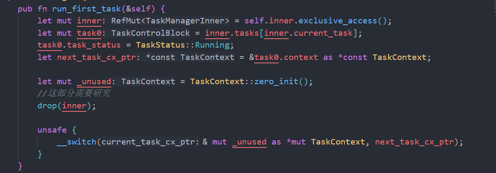

然后实现了分时系统的后一半功能吧，timer时钟中断和suspend_current_run_next功能。

实现的时候有个感觉，先针对于自己实现的结构体实现一些方法，而后实现一些函数依赖于这些方法，这些函数就可以用于实现系统调用和处理Trap的目的。

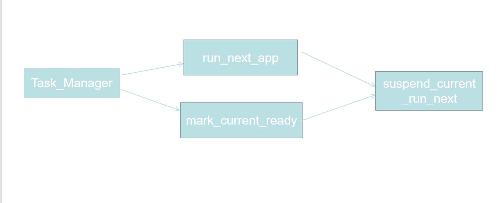

上图基本描述了主要的思想，Task_Manager是抽象的结构体，中间的两个事这个结构体关联的方法，最后的suspend_current_run_next是支持trap处理和syscall处理的独立函数。

今晚初步实现了分时系统。效果如下所示。

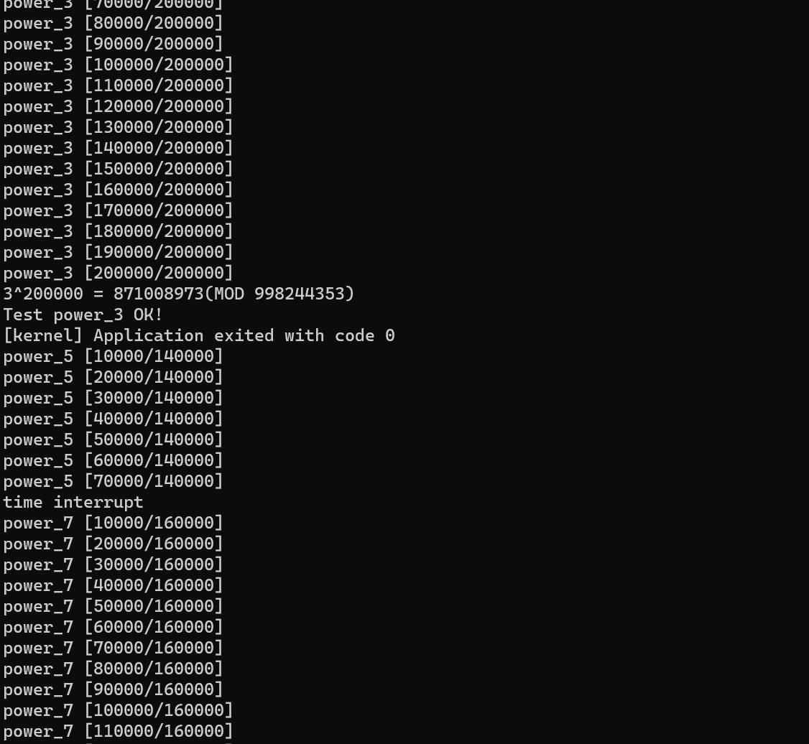

### 8.19

今天将运行操作系统需要的几个命令集成到一个python脚本中。

还实现了第三章剩下的几个系统调用，yield，task_info，get_time。

实现效果如下：

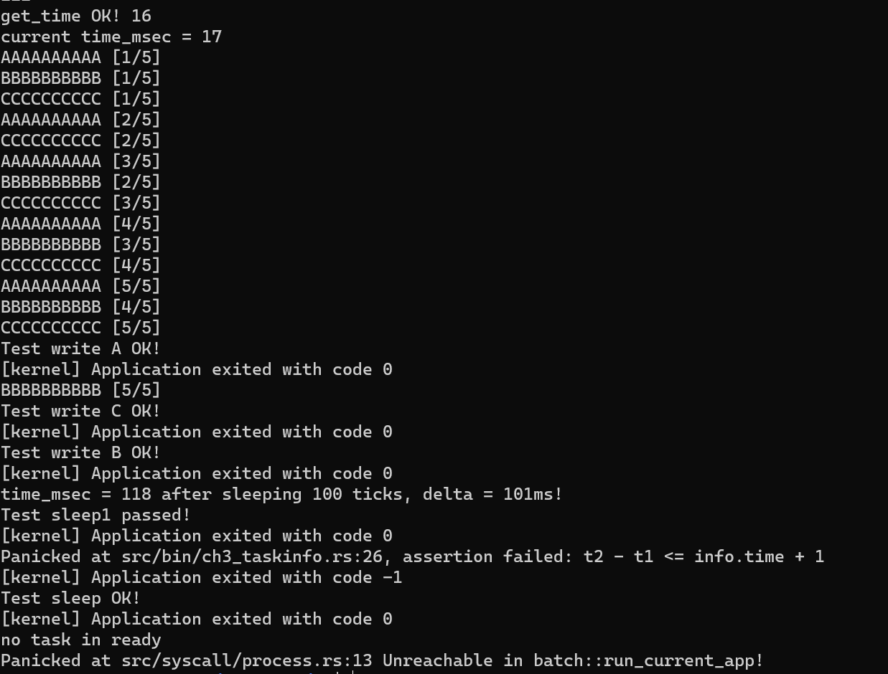

在实现的过程中发现了一些有趣的东西。

* 我的实现版本，由于把内核栈和用户栈都加到了TCB中，所以需要将初始栈调大，要不然就运行不了。将栈的大小设置为4096*300
* 第二点是，syscall执行的过程中参数的转化问题，参数用寄存器传递，默认为usize，需要将其转换为对应的结构体指针。


### 8.20

今天耽搁一天。

### 8.21

今天在和刘同学的交流过程中有了几个问题。

* 陷入trap后切换应用程序中函数的执行顺序和各自作用是什么？
* 第三章中运行第一个程序是用switch函数设置sp为指定的内核栈，设置ra为restore函数的地址来实现指向正确的内核栈，以及切换到用户态。那么和第三章逻辑不同的第二章是怎么实现切换到指定的内核栈呢？

问题一的答案：

陷入trap，首先调用alltraps函数，将trap上下文（32个寄存器，sstatus，sepc）给压入内核栈，然后调用switch函数，将sp设置为下一个任务的内核栈栈顶指针；根据TaskContext设置的ra调用restore函数（所有任务的TaskContext中在初始化时，ra都初始化为restore函数的地址），根据指定的sp来恢复trap上下文。

问题二的答案：

第二章直接用的是restore函数，直接将内核栈顶指针传进去。

所以第三章的restore函数，不需要mv sp a0了，因为通过switch函数就实现了sp的赋值，不需要这条指令了。

以及引出了第三个问题

* 第二章的trap处理中调用restore函数和第三章中trap处理中调用restore函数有什么区别？

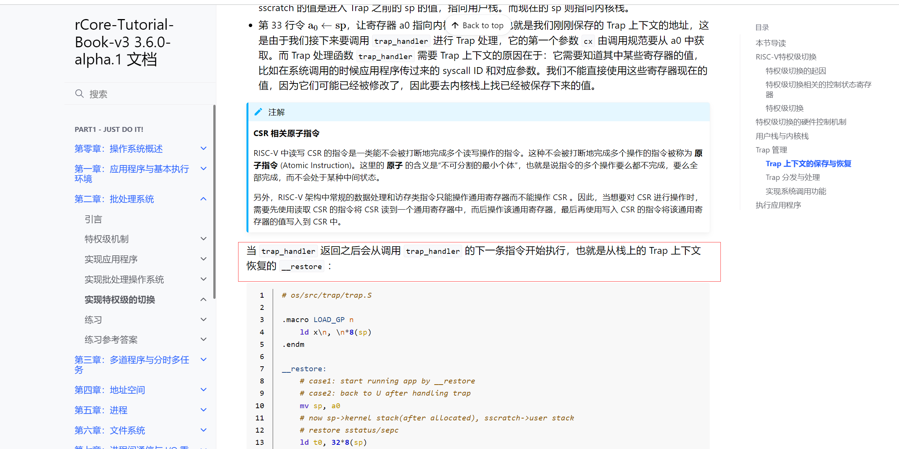

第二章的调用restore是类似于“pc+1”，自动调用的。而第三章在trap处理中插入了一个switch函数，switch完之后可以利用ra寄存器得到restore函数的地址。

第四个问题

* 分时多任务系统，每个程序的程序上下文中的ra在用户程序执行的过程中会改变吗？

目前假定是不变的。

### 8.23

看了看第四章的文档，将页表相关的抽象结构体都写出来了。

### 8.24

今天继续看第四章的文档，快到跳板页那块了。

### 8.30

今天将第四章的文档看完了，看着文档大致把代码给写完了，明天看看能不能运行。